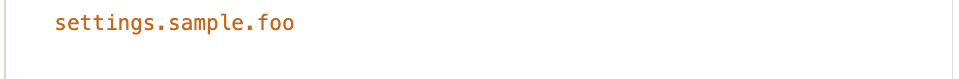
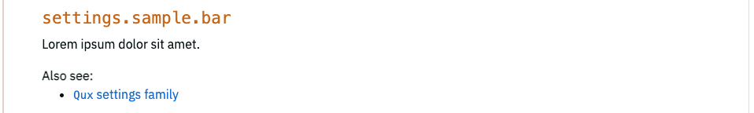
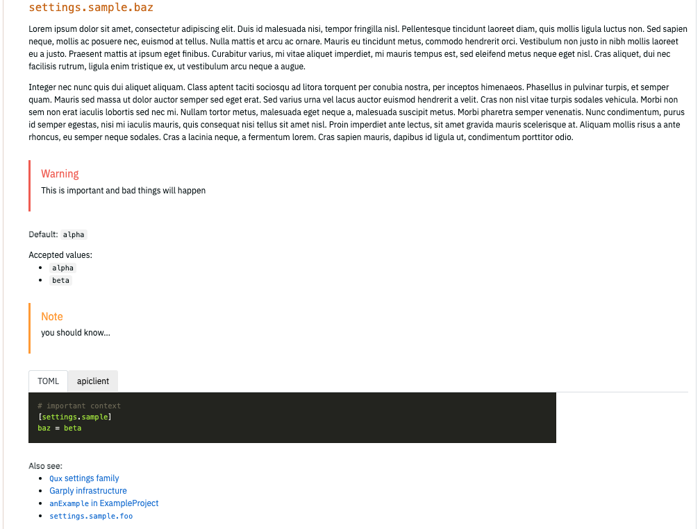
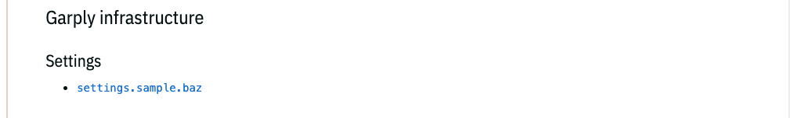
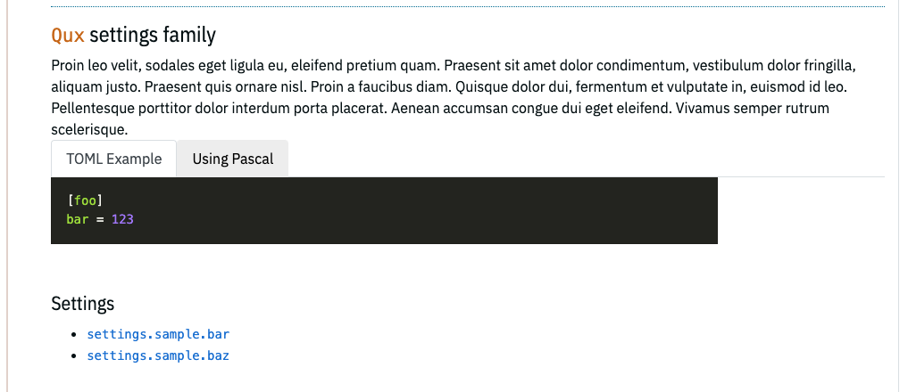

# TOML DSL for Bottlerocket Settings

## Introduction

Users of Bottlerocket interact with the OS primarily through the API to change settings. These settings are somewhat unique to Bottlerocket, so the project needs to carefully and accessibly describe these settings. Previous attempts to document settings used only markdown; as the number of settings grew the inconsistencies and organizational challenges increased as well.

This document defines how Bottlerocket can use semi-structured TOML to document settings, allowing for richer rendering, better organization, and more consistency.

## Documenting Settings, high-level overview

For the purpose of this documentation, Bottlerocket settings have a _root_ (always `settings`), a _group_ (anything after the first `.`, e.g. `kubernetes`, `ecs`, `oci-hooks`, etc.), and a _property_.
This is most often represented by `[root].[group].[property]`.
(In the case of `settings.motd` consider `motd` to be a group with settings, however this is a outlier.)

Each group has it's own TOML file (either dedicated file or as part of another TOML file). All of the properties under a group are documented together under a structure called `docs.ref`.
Example:
| Bottlerocket setting | File | Documentation key in file |
|----------------------|------|-------------------|
| `settings.kubernetes.api-server` | `kubernetes.toml` | `docs.ref.api-server` |
| `settings.ecs.loglevel` | `ecs.toml` | `docs.ref.loglevel` |
| `settings.network.hostname` | `network.toml` | `docs.ref.hostname` |

Under each key is the description of what that setting does as well as any information about the setting (accepted values, notes, warning, examples).

Settings are grouped together using a tagging mechanism.
Tags are added to settings; many tags can be added to a single setting and many settings can have the same tag.
Tags are described in the same TOML file under the structure `docs.tag`.

## Structure

Documentation for settings are expressed as [TOML v1.0.0](https://toml.io/en/v1.0.0).

All documentation starts at the key `docs`.

Settings in Bottlerocket are represented by at least a 2-level nesting, and most commonly 3-level nesting starting with `settings`.
All settings in a group are documented together under `docs`.

`docs` contains two [arrays of tables](https://toml.io/en/v1.0.0#array-of-tables): `ref` and `tag`.

* `ref` (short for “reference”) contains the documentation for an individual setting.
* `tag` contains groupings of settings that need to be documented together.

For example, documenting `settings.foo.mysetting` would look something like this:

Filename: `foo.toml`

```toml
...
[[docs.ref.mysetting]]
tags = [ "some-tag" ]
description = "..."
...
```

The process building the documentation would either be explicitly instructed that everything `foo.toml` relates to `settings.foo`  or it will derive it by filename or other means.

Under the same structure, a tag looks like:

```toml
[[docs.tag.some-tag]]
heading = "My Heading"
description = "Some description"
```

Because `docs.ref.mysetting.tags`  contains `some-tag` the relationship is established. The rendered output of `some-tag` and `mysetting` will reference each other. Any setting can have multiple `tags` and any tag can be related to multiple settings.

## Documenting Settings

Parent: `docs.ref`
Name/id: setting being documented
Children:

* `description` (optional, [string](https://toml.io/en/v1.0.0#string), markdownified): description of the setting
* `default` (optional, [string](https://toml.io/en/v1.0.0#string), markdownified): description of any defaults for the setting. Will be prefixed with “Default:”
* `see` (optional, [array](https://toml.io/en/v1.0.0#array) of array): “Also see” information. Each array contains either:
  * a single element array of string: This contains a markdownified string.
  Useful for adding a link to an external or website.
  Example: `["[Some informative link](`[`http://www.example.com/foo/bar`](http://www.example.com/foo/bar)`)"]`
  * a 2 or 3 element array of string that represents another setting split by `.`.
  Example (to `setting.foo.mysetting`): `[ "settings", "foo", "mysetting" ]`
* `note` (optional, [string](https://toml.io/en/v1.0.0#string), markdownified): A non-dangerous, context setting piece of information.
Will have the heading “Note” andis  rendered separately after the `description`
* `warning` (optional, [string](https://toml.io/en/v1.0.0#string), markdownified): Information that warns the reader of potentially dangerous outcomes.
Will have the heading “Warning” and is rendered separately after the `description`
* `accepted_values` (optional, [array](https://toml.io/en/v1.0.0#array) of [string](https://toml.io/en/v1.0.0#string), each string is markdownified): A representation of allowed values, typically for enums where there are specific allowable strings in a setting value.
* `deprecated` (optional, [boolean](https://toml.io/en/v1.0.0#boolean)): If `true`, the setting will be marked as 'deprecated'
* `name_override` (optional, [string](https://toml.io/en/v1.0.0#string)): In situations where a setting cannot be represented as a 3-element array, this string can override the textual and linking representation.
For example, if you have a setting like `setting.foo.bar.<some index>.baz` , you can define the documentation under `bar-index-baz` and set `name_override` to `bar.<some index>.baz`  to make it render to the reader correctly.
Hash links and references would still use  `bar-index-baz`.
* `example` (optional, [array of tables](https://toml.io/en/v1.0.0#array-of-tables)):
  * Three different types of tables are allowed as examples
    * Simple: Generated TOML and apiclient representations, auto-populating the setting name. This is good for single line examples.
      * `value` (required, string or number) an example value.
      * `comment` (optional, markdownified) a comment that explains the value.
    * Multiline:  Used when giving an example that has multiple children under a given setting. Setting name will be auto-populated.
      * `comment` (optional, markdownified) a comment that explains the value.
      * `multiline` (required, [table](https://toml.io/en/v1.0.0#table)) the children of the setting.
    * Direct (TOML and shell): A free form representation that will be rendered as written in a syntax highlighter.
      * `direct_toml` (optional, string) A string representation of TOML. Will be put through the [Chroma](https://github.com/alecthomas/chroma) TOML highlighter and placed under a “TOML” tab or heading.
      * `direct_shell` A string representation of apiclient. Will be put through the [Chroma](https://github.com/alecthomas/chroma) shell highlighter and placed under a “apiclient” tab or heading.
      * `direct_yaml` A string representation of yaml. Will be put through the [Chroma](https://github.com/alecthomas/chroma) yaml highlighter and placed under a “YAML” tab or heading.

## Adding tags/topics

Note: “tagging” is the mechanism which the documentation uses to relate settings. The tag itself may not be surfaced to the reader. On the documentation site, for example, they are rendered as topics.

Parent: `docs.ref`
Name/id: tag being defined
Children:

* `heading` : (optional, [string](https://toml.io/en/v1.0.0#string), markdownified) The short form description of the tag’s topic. Rendered as a heading, but may also be rendered in other contexts (e.g. in “Also see:”)
* `description`: (optional, string, markdownified) The description of the relationship between the settings with the tag.
* `example:` (optional, [array of tables](https://toml.io/en/v1.0.0#array-of-tables))
  * `tab` (required, string) The title of the tab
  * `type` (required, string) A valid [Chroma](https://github.com/alecthomas/chroma) highlighter ID.
  * `source` (required, string) The text which will be highlighted.

## Examples

Assume all of these examples are in `sample.toml`

### Simplest Valid Setting

#### TOML

```toml
# simplest form, technically correct but not advised
[[docs.ref.foo]]
```

#### Rendered



### Minimal Setting

#### TOML

```toml
# slightly more complex, just a description and a tag
[[docs.ref.bar]]
description = "Lorem ipsum dolor sit amet."
tags = [
    "qux"
]
```

#### Rendered



### Kitchen Sink Setting

#### TOML

```toml
# kitchen sink
[[docs.ref.baz]]
description = """
Lorem ipsum dolor sit amet, consectetur adipiscing elit. Duis id malesuada nisi, tempor fringilla nisl. Pellentesque tincidunt laoreet diam, quis mollis ligula luctus non. Sed sapien neque, mollis ac posuere nec, euismod at tellus. Nulla mattis et arcu ac ornare. Mauris eu tincidunt metus, commodo hendrerit orci. Vestibulum non justo in nibh mollis laoreet eu a justo. Praesent mattis at ipsum eget finibus. Curabitur varius, mi vitae aliquet imperdiet, mi mauris tempus est, sed eleifend metus neque eget nisl. Cras aliquet, dui nec facilisis rutrum, ligula enim tristique ex, ut vestibulum arcu neque a augue.
Integer nec nunc quis dui aliquet aliquam. Class aptent taciti sociosqu ad litora torquent per conubia nostra, per inceptos himenaeos. Phasellus in pulvinar turpis, et semper quam. Mauris sed massa ut dolor auctor semper sed eget erat. Sed varius urna vel lacus auctor euismod hendrerit a velit. Cras non nisl vitae turpis sodales vehicula. Morbi non sem non erat iaculis lobortis sed nec mi. Nullam tortor metus, malesuada eget neque a, malesuada suscipit metus. Morbi pharetra semper venenatis. Nunc condimentum, purus id semper egestas, nisi mi iaculis mauris, quis consequat nisi tellus sit amet nisl. Proin imperdiet ante lectus, sit amet gravida mauris scelerisque at. Aliquam mollis risus a ante rhoncus, eu semper neque sodales. Cras a lacinia neque, a fermentum lorem. Cras sapien mauris, dapibus id ligula ut, condimentum porttitor odio.
"""
accepted_values = [
    "`alpha`",
    "`beta`"
]
note = "you should know..."
warning = "This is important and bad things will happen"
default = "`alpha`"
see  = [
    ["[`anExample` in ExampleProject](http://www.example.com/)"],
    [ "settings", "sample","foo" ]
]
tags = [
    "qux",
    "garply"
]
[[docs.ref.baz.example]]
comment = "important context"
value = "beta"
```

### Rendered



### Minimal Tag

#### TOML

```toml
[[docs.tag.garply]]
heading = "Garply infrastructure"
```

#### Rendered



### Kitchen Sink Tag

#### TOML

```toml
[[docs.tag.qux]]
heading = "`Qux` settings family"
description = "Proin leo velit, sodales eget ligula eu, eleifend pretium quam. Praesent sit amet dolor condimentum, vestibulum dolor fringilla, aliquam justo. Praesent quis ornare nisl. Proin a faucibus diam. Quisque dolor dui, fermentum et vulputate in, euismod id leo. Pellentesque porttitor dolor interdum porta placerat. Aenean accumsan congue dui eget eleifend. Vivamus semper rutrum scelerisque."
[[docs.tag.qux.example]]
tab = "TOML Example"
type = "toml"
source = """
[foo]
bar = 123
"""
[[docs.tag.qux.example]]
tab = "Using Pascal"
type = "pascal"
source = """
BEGIN
    writeln("hello world");
END.
"""
```

#### Rendered



---
Style rules:

**Optimize for multi-line arrays to better work with version control:**
Undesirable:

```toml
accepted_values = ["`alpha`", "`beta`"]
```

Better:

```toml
accepted_values = [
    "`alpha`", 
    "`beta`"
]
```

**Have one sentence per line and use heredoc quoting to better work with version control:**
Undesirable:

```toml
description="This is one thought. This is another."
```

Better:

```toml
description="""
This is one thought.
This is another.
"""
```

**Use fields instead of re-creating the field elsewhere.**
Undesirable:

```toml
description="Lorem ipsum... Acceptable values are `foo` and `bar`"
```

Better:

```toml
description="Lorem ipsum..."
accepted_values = [
    "`foo`", 
    "`bar`"
]
```

## Philosophy

* The primary target should be the Bottlerocket website, but the structure should be loosely coupled enough for it be useful for other potential purposes such as help text, man pages, and generated guides.
* Setting documentation should be considered atomic and linkable. Assume that a user may read only the information for that single setting: any critical information should be conveyed on that single documentation entry.
* Tags (“topics”) can convey information but only one-to-many information that contextually applies to all settings within the same tag.
* Use the structured key/value fields as much as possible and only use free-form options when the structured keys do not apply. However, any documentation is better than none!
